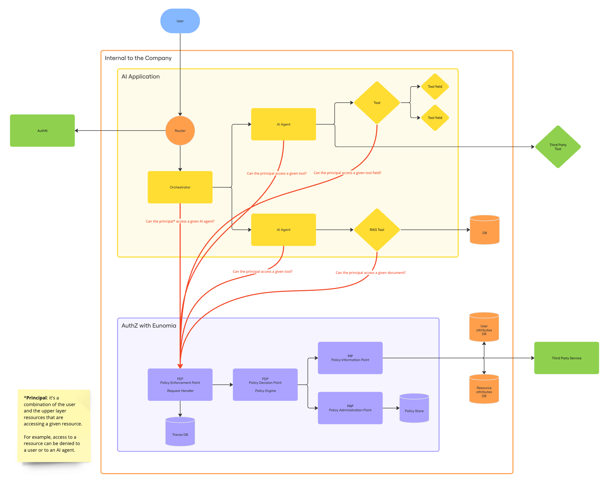

</img>

_Authorization layer for AI Agents_

Made with ❤ by the team at [What About You][whataboutyou-website].

[Read the docs][docs] · [Join the Discord][discord]

> [!WARNING]  
> Eunomia is currently under a major restructuring.
>
> Stay tuned for a new release or join the [Discord][discord] to access the preview.

## Why Eunomia?

As AI-driven applications evolve, the necessity of separating authorization concerns from core logic becomes more apparent. By implementing policy enforcement as a distinct service, developers can ensure that AI Agents operate efficiently while maintaining the flexibility needed to adapt to changing security landscapes.

This library aims to provide a structured approach to **decoupling authorization policies from AI Agent architectures**, enabling developers to focus on agents' performance while ensuring robust and scalable security mechanisms.

> [!NOTE]  
> Currently, this library encompasses the first iterations of this framework where we tested integrating specific data redaction tools, agentic frameworks, and access policy rules.
>
> Some examples are:
>
> - Integration with Anthropic's MCP: [link][eunomia-mcp]
> - Text redaction with Microsoft Predisidio and custom fintuned models hosted on Hugging Face
> - Role-based and ID-based policy enforcement
>
> After testing and validating the framework against the mentioned concrete cases, we are now working on making this library more generic and easier to extend.

Stay tuned for the new release!

[whataboutyou-website]: https://whataboutyou.ai
[docs]: https://whataboutyou-ai.github.io/eunomia/
[discord]: https://discord.gg/TyhGZtzg3G
[eunomia-mcp]: https://github.com/whataboutyou-ai/eunomia-mcp-server
