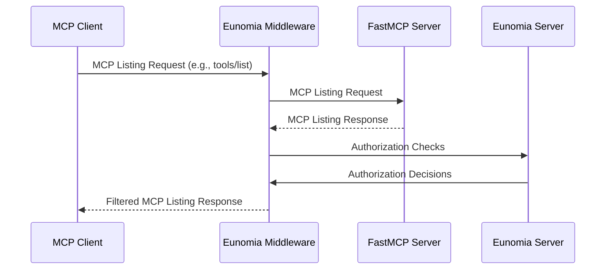
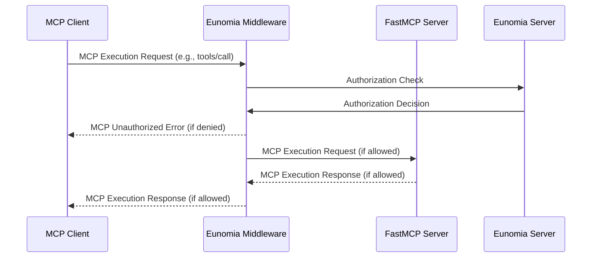

The Eunomia MCP Authorization Middleware provides **policy-based authorization** for [Model Context Protocol (MCP)][mcp-docs] servers built with [FastMCP][fastmcp-docs]. It enables you to secure your MCP servers with fine-grained access control policies with minimal code changes.

## Overview

### Features

- 🔒 **Policy-Based Authorization**: Control which agents can access which MCP tools, resources, and prompts
- 📊 **Audit Logging**: Track all authorization decisions and violations
- ⚡ **FastMCP Integration**: One-line middleware integration with FastMCP servers
- 🔧 **Flexible Configuration**: JSON-based policies for complex dynamic rules with CLI tooling
- 🎯 **MCP-Aware**: Built-in understanding of MCP protocol (tools, resources, prompts)

### Architecture

The Eunomia middleware intercepts all MCP requests to your server and automatically maps MCP methods to authorization checks.

#### Listing Operations

The middleware behaves as a filter for listing operations (`tools/list`, `resources/list`, `prompts/list`), hiding to the client components that are not authorized by the defined policies.



#### Execution Operations

The middleware behaves as a firewall for execution operations (`tools/call`, `resources/read`, `prompts/get`), blocking operations that are not authorized by the defined policies.



## Installation

Install the extension via pip:

```bash
pip install eunomia-mcp
```

## Quick Start

### Basic Integration

```python
from fastmcp import FastMCP
from eunomia_mcp import EunomiaMcpMiddleware

# Create your FastMCP server
mcp = FastMCP("Secure MCP Server 🔒")

@mcp.tool()
def add(a: int, b: int) -> int:
    """Add two numbers"""
    return a + b

# Add Eunomia authorization middleware
middleware = EunomiaMcpMiddleware()

# Create ASGI app with authorization
app = mcp.add_middleware(middleware)

if __name__ == "__main__":
    mcp.run()
```

### Start Eunomia Server

The middleware requires a running Eunomia server to make policy decisions:

```bash
# Install and start Eunomia server
pip install eunomia-ai
eunomia server
```

Refer to the [Eunomia server documentation](../../get_started/user_guide/run_server.md) for additional configuration options.

## Configuration

### Middleware Options

Configure the middleware for production deployments:

```python
from eunomia_mcp import create_eunomia_middleware

middleware = [
    create_eunomia_middleware(
        eunomia_endpoint="https://your-eunomia-server.com",
        eunomia_api_key="your-api-key",
        enable_audit_logging=True,
    )
]
```

#### Parameters

| Parameter              | Type   | Default                 | Description                            |
| ---------------------- | ------ | ----------------------- | -------------------------------------- |
| `eunomia_endpoint`     | `str`  | `http://localhost:8421` | Eunomia server URL                     |
| `eunomia_api_key`      | `str`  | `None`                  | API key (or set `WAY_API_KEY` env var) |
| `enable_audit_logging` | `bool` | `True`                  | Enable request/violation logging       |

### Environment Variables

```bash
# Eunomia server configuration
export WAY_ENDPOINT=https://your-eunomia-server.com
export WAY_API_KEY=your-secret-api-key

# Logging level
export PYTHONLOGLEVEL=INFO
```

## Policy Management CLI

Use the `eunomia-mcp` CLI in your terminal to manage your MCP authorization policies:

#### Initialize a New Project

```bash
# Create a default policy configuration file
eunomia-mcp init

# Create policy configuration file with custom name
eunomia-mcp init --policy-file my_policies.json

# Generate both policy configuration file and a sample MCP server
eunomia-mcp init --sample
```

You can edit the created `mcp_policies.json` policy configuration file to your liking. Refer to the [templates][policy-templates] for example policies and rules.

### Validate Policy Configuration

```bash
# Validate your policy file
eunomia-mcp validate mcp_policies.json
```

### Push Policies to Eunomia

```bash
# Push your policy to Eunomia server
eunomia-mcp push mcp_policies.json

# Push your policy and overwrite existing ones
eunomia-mcp push mcp_policies.json --overwrite
```

!!! info
    You need the Eunomia server running for the push operation.

### Development Workflow

1. **Initialize**: `eunomia-mcp init --sample`
2. **Customize**: Edit generated policy file
3. **Validate**: `eunomia-mcp validate policies.json`
4. **Start Server**: `eunomia server`
5. **Deploy**: `eunomia-mcp push policies.json`
6. **Test**: Run your MCP server with middleware

## Authentication & Authorization

### MCP Method Mappings

| MCP Method       | Resource URI           | Action | Middleware behavior                       |
| ---------------- | ---------------------- | ------ | ----------------------------------------- |
| `tools/list`     | `mcp:tools:{name}`     | `list` | Filters the server's response             |
| `resources/list` | `mcp:resources:{name}` | `list` | Filters the server's response             |
| `prompts/list`   | `mcp:prompts:{name}`   | `list` | Filters the server's response             |
| `tools/call`     | `mcp:tools:{name}`     | `call` | Blocks/forwards the request to the server |
| `resources/read` | `mcp:resources:{name}` | `read` | Blocks/forwards the request to the server |
| `prompts/get`    | `mcp:prompts:{name}`   | `get`  | Blocks/forwards the request to the server |

The middleware extracts contextual attributes from the MCP request and passes them to the decision engine; these attributes can therefore be referenced inside policies to define dynamic rules.

| Attribute        | Type              | Description                                              | Sample value           |
| ---------------- | ----------------- | -------------------------------------------------------- | ---------------------- |
| `method`         | `str`             | The MCP method                                           | `tools/list`           |
| `component_type` | `str`             | The type of component: `tools`, `resources` or `prompts` | `tools`                |
| `name`           | `str`             | The name of the component                                | `file_read`            |
| `uri`            | `str`             | The MCP URI of the component                             | `mcp:tools:file_read`  |
| `arguments`      | `dict` (Optional) | The arguments of the execution operation                 | `{"path": "file.txt"}` |

### Agent Authentication

Agents are identified through HTTP headers:

```http
POST /mcp HTTP/1.1
X-Agent-ID: claude
X-User-ID: user123
User-Agent: Claude
Authorization: Bearer api-key-here
Content-Type: application/json
```

#### Principal Extraction

The middleware extracts principals as follows:

| Header                      | Principal URI  | Attributes                 |
| --------------------------- | -------------- | -------------------------- |
| `X-Agent-ID: claude`        | `agent:claude` | `{"agent_id": "claude"}`   |
| `X-User-ID: user123`        |                | `{"user_id": "user123"}`   |
| `User-Agent: Claude`        |                | `{"user_agent": "Claude"}` |
| `Authorization: Bearer xyz` |                | `{"api_key": "xyz"}`       |

#### Custom Principal Extraction

Override the default principal extraction logic:

```python
from eunomia_core import schemas
from eunomia_mcp import EunomiaMcpMiddleware

class CustomAuthMiddleware(EunomiaMcpMiddleware):
    def _extract_principal(self) -> schemas.PrincipalCheck:
        headers = get_http_headers()
        token = headers.get("Authorization", "").replace("Bearer ", "")

        # Extract from JWT token
        if token:
            payload = decode_jwt(token)  # Your JWT decoding logic
            return schemas.PrincipalCheck(
                uri=f"user:{payload['sub']}",
                attributes={
                    "role": payload.get("role"),
                    "department": payload.get("dept")
            }
            )

        # Fallback to default
        return super()._extract_principal()

# Use custom middleware
middleware = CustomAuthMiddleware()
```

## Logging & Monitoring

### Audit Logging

Enable comprehensive audit trails:

```python
import logging

# Configure logging
logging.basicConfig(level=logging.INFO)
logger = logging.getLogger("eunomia_mcp")

# Log messages include:
# INFO: Authorized request | MCP method: tools/call | MCP uri: mcp:tools:file_read | User-Agent: Claude
# WARNING: Authorization violation: Access denied for tools/call | MCP method: tools/call | MCP uri: mcp:tools:file_read | User-Agent: Claude
```

### Log Categories

- **INFO**: Successful authorization decisions
- **WARNING**: Authorization violations
- **ERROR**: System errors (Eunomia server issues, etc.)

## Advanced Usage

### Production Deployment

```python
from fastmcp import FastMCP
from eunomia_mcp import create_eunomia_middleware

# Production configuration
mcp = FastMCP("Production MCP Server")

middleware = [
    create_eunomia_middleware(
        eunomia_endpoint="https://eunomia.yourcompany.com",
        eunomia_api_key=os.getenv("EUNOMIA_API_KEY"),
        enable_audit_logging=True,
    )
]

app = mcp.add_middleware(middleware)

if __name__ == "__main__":
    mcp.run(
        transport="http",
        host="0.0.0.0",
        port=8080,
    )
```

## Troubleshooting

### Common Issues

**Eunomia server not running**

```
ERROR: Authorization check failed: Connection refused
```

Solution: Start Eunomia server with `eunomia server`

**Missing policies**

```
WARNING: Authorization violation: No matching policy found
```

Solution: Push policies with `eunomia-mcp push policies.json`

**Invalid JSON-RPC**

```
ERROR: Invalid Request: Invalid JSON-RPC 2.0 format
```

Solution: Ensure MCP client sends valid JSON-RPC 2.0 requests

### Debug Mode

Enable detailed logging:

```python
import logging
logging.getLogger("eunomia_mcp").setLevel(logging.DEBUG)
logging.getLogger("eunomia_sdk").setLevel(logging.DEBUG)
```

## API Reference

:::eunomia_mcp.create_eunomia_middleware

[mcp-docs]: https://modelcontextprotocol.io
[fastmcp-docs]: https://gofastmcp.com/
[policy-templates]: https://github.com/whataboutyou-ai/eunomia/tree/main/pkgs/extensions/mcp/templates
