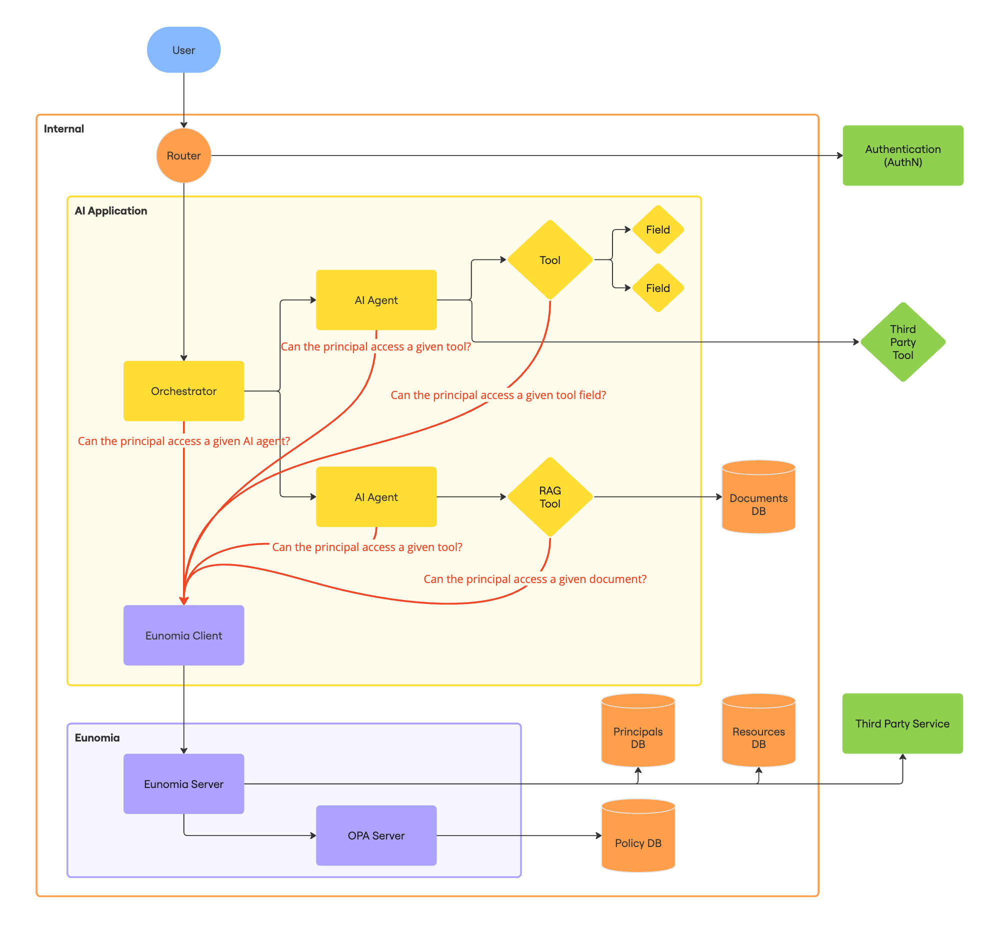

## What is Eunomia?

Eunomia is a Python library that allows you to decouple the authorization logic from the main architecture of your AI Agent. Eunomia is built as a standalone authorization server that can serve any application.

It is built and maintained by [What About You][whataboutyou-website], while contributions are welcome from the [community](../community/index.md).

!!! warning
    Eunomia is currently under active development and therefore subject to change.

## How to Get Started?

-   :material-clock-fast:{ .lg .middle } __Set up in seconds__

    ---

    Install `eunomia` with `pip` and get up and running in seconds

    [:material-arrow-right: Installation](installation.md#install-latest-release)

-   :material-play-speed:{ .lg .middle } __Start with an example__

    ---

    Get started with Eunomia by following the quickstart example

    [:material-arrow-right: Quickstart](quickstart.md)

-   :material-application-brackets-outline:{ .lg .middle } __Integrate within your codebase__

    ---

    Use one of the available SDKs to integrate Eunomia into your project

    [:material-arrow-right: Explore SDKs](../sdks/index.md)

-   :material-scale-balance:{ .lg .middle } __Open Source__

    ---

    Eunomia is licensed under Apache 2.0 and available on [GitHub][eunomia-github]

    [:material-arrow-right: License](license.md)

## Why Eunomia?

As AI-driven applications evolve, the necessity of separating authorization concerns from core logic becomes more apparent. By implementing policy enforcement as a distinct service, developers can ensure that AI Agents operate efficiently while maintaining the flexibility needed to adapt to changing security landscapes.

This library aims to provide a structured approach to **decoupling authorization policies from AI Agent architectures**, enabling developers to focus on agents' performance while ensuring robust and scalable security mechanisms.

## How does Eunomia work?

Eunomia is a standalone authorization server that can be integrated into any application. It follows a client-server architecture where the server handles all authorization logic, while clients interact with it through a REST API or available SDKs.

### Architecture Overview

Eunomia uses a decoupled architecture consisting of two main components:

1. **Server**: A standalone service that manages authorization policies, storing metadata for principals and resources, and making access control decisions. The server is built on top of [Open Policy Agent (OPA)][opa-website] and exposes a REST API.

2. **Client**: A component integrated into your application that communicates with the Eunomia server. You can interact with the server either directly through HTTP requests or by using one of the provided SDKs for a more streamlined experience.

### Authorization Workflow

Working with Eunomia involves two distinct phases:

#### Policy Configuration Phase

In this phase, you configure the authorization policies that will govern access control in your application:

- **Define Policies**: Write policies using the Rego policy language to specify access rules based on principals and resources attributes.
- **Register Resources**: Register the resources (like documents, applications, or AI agents) that need to be protected, along with their metadata.
- **Register Principals**: Register the principals (entities requesting access[*](#understanding-principals)) with their metadata that will be used for authorization decisions.

For example, you might register an AI agent as a resource with its capabilities as metadata, and register users as principals with their roles and departments as metadata.

#### Policy Enforcement Phase

At runtime, your application enforces the configured policies by:

- **Access Checks**: Sending access check requests to the Eunomia server, providing both the principal ID and resource ID.
- **Policy Evaluation**: The server retrieves the metadata for both entities and evaluates it against the defined policies.
- **Authorization Decision**: The server returns a boolean result indicating whether access should be granted or denied.

### What is a Principal?

In Eunomia, a _principal_ represents an entity requesting access to a resource. What makes Eunomia powerful is that a principal can be:

- A single actor (like a user)
- A combination of multiple actors (like a user interacting through a specific AI agent)

This allows for complex authorization scenarios where access depends not just on who is requesting access, but also on the context of the request.

## Development Roadmap

- [ ] Easier policy definition without Rego
- [ ] Integration for LangChain
    - [x] Streamline documents from LangChain loaders
    - [ ] Enforce policies on LangChain retrievers
- [ ] Integration for LangGraph

[eunomia-github]: https://github.com/whataboutyou-ai/eunomia
[whataboutyou-website]: https://whataboutyou.ai
[opa-website]: https://www.openpolicyagent.org/
