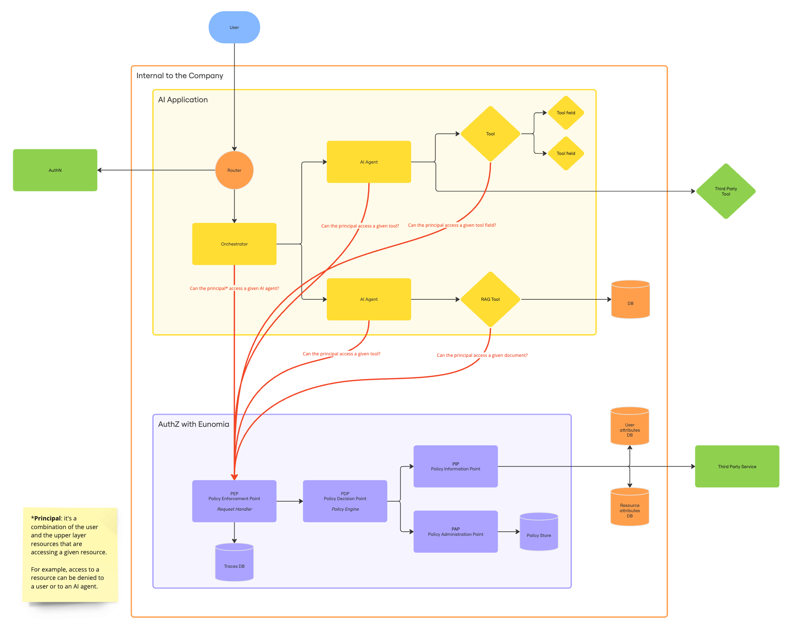

Eunomia is a standalone authorization server that can be integrated into any application. It follows a client-server architecture where the server handles all authorization logic, while clients interact with it through a REST API or available SDKs.

### Architecture Overview

Eunomia uses a decoupled architecture consisting of two main components:

1. **Server**: A standalone service that manages authorization policies, storing metadata for principals and resources, and making access control decisions. The server exposes a REST API.

2. **Client**: A component integrated into your application that communicates with the Eunomia server. You can interact with the server either directly through HTTP requests or by using one of the provided SDKs for a more streamlined experience.

### Authorization Workflow

Working with Eunomia involves two distinct phases:

#### Policy Configuration Phase

In this phase, you configure the authorization policies that will govern access control in your application based on principals and resources attributes.

For example, you might register an AI agent as a resource with its capabilities as metadata, and register users as principals with their roles and departments as metadata.

#### Policy Enforcement Phase

At runtime, your application enforces the configured policies by:

- **Check Requests**: Sending check requests to the Eunomia server
- **Policy Evaluation**: The server retrieves the metadata for entities given and evaluates it against the defined policies.
- **Authorization Decision**: The server returns a boolean result indicating whether the action should be allowed or denied.

### Eunomia components

Eunomia enables developers to create Policies that determine whether Principals can perform an action on specific Resources based on their Attributes. These four core concepts — Policies, Principals, Resources, and Attributes — form the foundation of Eunomia's authorization model. Principals and Resources are both categorized as Entities.

Let’s analyze each one individually.

#### Policies

_Policies_, which are the rules that determine whether _Principals_ can perform an action on specific _Resources_. The policies are stored and accessed whenever necessary. By default, we deny actions, so any allowed behavior must be explicitly defined in the policy.

#### Principals

_Principals_ encompass humans, AI agents, or a combination thereof. The term is consistently plural to represent the chain of actors involved in a given action. This could range from a simple human database query to a complex interaction where a human engages with an agent that consults another, which then queries a database. The potential complexity of such chains is evident.

Enforcing restrictions across the entire _Principal_ chain is crucial, even when the final _Principal_ executes the action. Access privileges are inherently intertwined within these chains.

#### Resources

_Resources_, akin to _Principals_, are _Entities_. They can be Data, Tools, or AI agents, representing what a specific list of _Principals_ seeks to perform an action on. When AI agent access requires regulation, they function as Resources, enabling control by humans or other AI agents.

The _Resource_ concept is particularly crucial as, unlike legacy authorization tools focused on static resources, it extends to Tools and AI agents, providing the opportunity for a fundamentally new approach to what _Principals_ can perform an action on.

#### Attributes

_Attributes_ are metadata associated with _Entities_, forming the basis for Policy creation by determining _Principal_ actions on specific _Resources_.

_Attributes_ can be registered at configuration time or shared at runtime. _Attributes_ encompass a broad range of elements. These may include human _Principal_ roles, AI agent metadata, agent output shared at runtime or even inputs from external tools.

## User Guides

| Guide                        | Description                                       | Jump to                                             |
| ---------------------------- | ------------------------------------------------- | --------------------------------------------------- |
| Run the Eunomia Server       | Learn how to configure and run the Eunomia server | [:material-arrow-right: Page](run_server.md)        |
| Create a Policy              | Learn how to create policies                      | [:material-arrow-right: Page](create_policies.md)   |
| Register an Entity           | Learn how to register entities                    | [:material-arrow-right: Page](register_entities.md) |
| Update and Delete an Entity  | Learn how to update or delete entities            | [:material-arrow-right: Page](upd_del_entities.md)  |
| Check Permissions at Runtime | Learn how to check permissions at runtime         | [:material-arrow-right: Page](check_permissions.md) |
