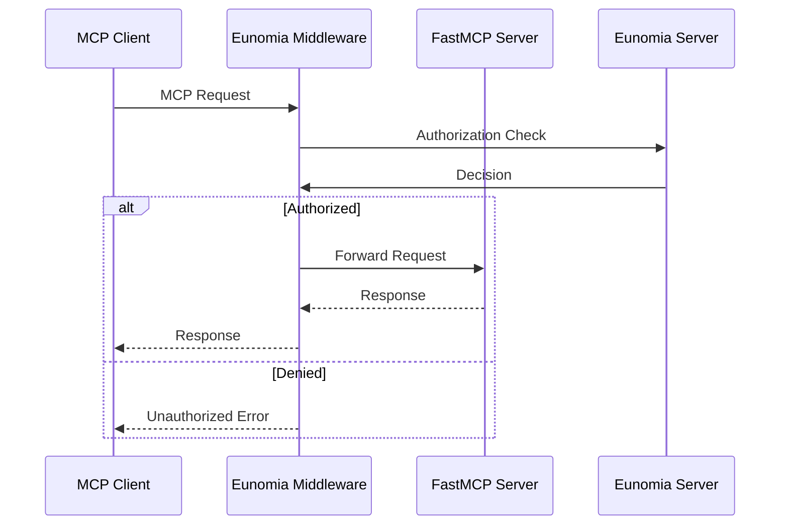

# MCP Middleware

Add **policy-based authorization** to your [Model Context Protocol (MCP)][mcp-docs] servers built with [FastMCP][fastmcp-docs] with minimal code changes.

## What is MCP Middleware?

The Eunomia MCP Middleware provides security and access control for MCP servers by intercepting requests and applying policy-based authorization decisions. It integrates seamlessly with FastMCP servers and provides comprehensive audit logging.

### Key Features

- 🔒 **Policy-Based Authorization**: Control which agents can access which MCP tools, resources, and prompts
- 📊 **Audit Logging**: Track all authorization decisions and violations
- ⚡ **FastMCP Integration**: One-line middleware integration with FastMCP servers
- 🔧 **Flexible Configuration**: JSON-based policies for complex dynamic rules with CLI tooling
- 🎯 **MCP-Aware**: Built-in understanding of MCP protocol (tools, resources, prompts)

## How It Works

The middleware intercepts all MCP requests to your server and automatically maps MCP methods to authorization checks:

- **Listing Operations** (`tools/list`, `resources/list`, `prompts/list`): Filters responses to hide unauthorized components
- **Execution Operations** (`tools/call`, `resources/read`, `prompts/get`): Blocks unauthorized requests

## User Workflows

Choose your path based on what you want to accomplish:

### 🚀 [Get Started Quickly](quickstart.md)
*I want to add authorization to my MCP server*

Set up the middleware with your existing FastMCP server in under 5 minutes.

### 🔧 [Configure Policies](policies.md)
*I want to define who can access what*

Create and manage authorization policies using our CLI tools and configuration files.

### 👥 [Customize Authentication](authentication.md)
*I want to control how agents are identified*

Configure custom principal extraction, JWT tokens, and authentication flows.

### 📊 [Monitor & Audit](monitoring.md)
*I want to track access and troubleshoot issues*

Set up logging, monitoring, and debugging for your authorization system.

### 🏗️ [Advanced Setup](advanced.md)
*I want production-ready configuration*

Deploy with custom endpoints, API keys, and enterprise features.

## Architecture Overview



## Installation

```bash
pip install eunomia-mcp
```

The middleware requires a running [Eunomia server](../get_started/user_guide/run_server.md) to make authorization decisions.

[mcp-docs]: https://modelcontextprotocol.io
[fastmcp-docs]: https://gofastmcp.com/