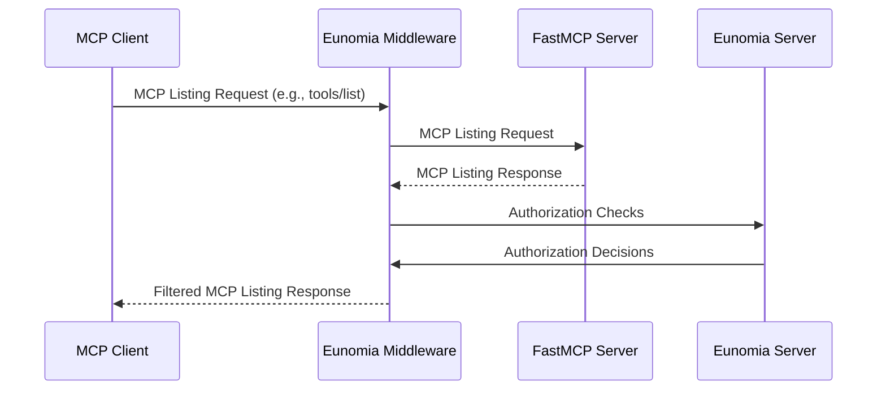
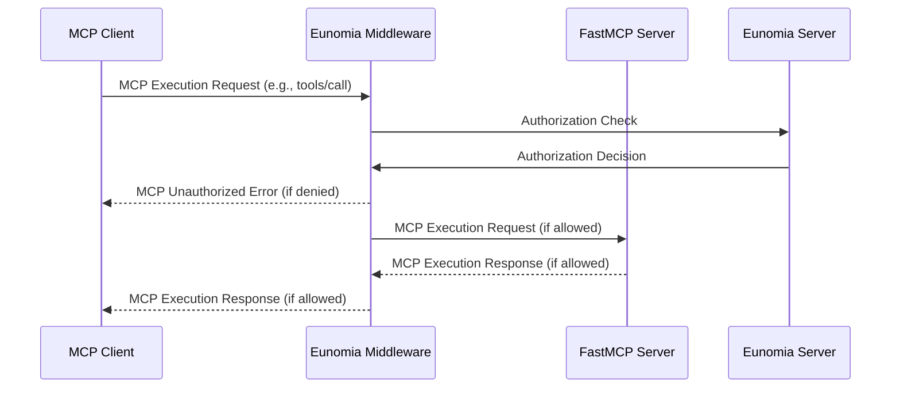

Add **policy-based authorization** to your [Model Context Protocol (MCP)][mcp-docs] servers built with [FastMCP][fastmcp-docs] with one line of code.

!!! tip "Note"

    Eunomia is the [official authorization middleware][fastmcp-eunomia-docs] of FastMCP!

## What is Eunomia MCP Middleware?

With the Eunomia MCP Middleware, you can control which tools, resources and prompts MCP clients can view and execute on your server. Define dynamic JSON-based policies and obtain a comprehensive audit log of all access attempts and violations.

### Key Features

-   🔒 **Policy-Based Authorization**: Control which agents can access which MCP tools, resources, and prompts
-   📊 **Audit Logging**: Track all authorization decisions and violations
-   🔄 **Centralized Policy Enforcement**: Optionally use a remote Eunomia server for centralized policy enforcement
-   ⚡ **FastMCP Integration**: One-line middleware integration with FastMCP servers
-   🔧 **Flexible Configuration**: JSON-based policies for complex dynamic rules with CLI tooling

## How It Works

The Eunomia middleware intercepts all MCP requests to your server and automatically maps MCP methods to authorization checks.

### Listing Operations

The middleware behaves as a filter for listing operations (`tools/list`, `resources/list`, `prompts/list`), hiding to the client components that are not authorized by the defined policies.



### Execution Operations

The middleware behaves as a firewall for execution operations (`tools/call`, `resources/read`, `prompts/get`), blocking operations that are not authorized by the defined policies.



## Installation

```bash
pip install eunomia-mcp
```

## User Workflows

Choose your path based on what you want to accomplish:

-   🚀 [Quickstart Guide](quickstart.md): Add authorization to your MCP server in under 5 minutes
-   🔧 [Policy Configuration](policies.md): Create and manage authorization policies using our CLI tools
-   👥 [Agent Authentication](authentication.md): Customize agent identification
-   🏗️ Advanced Features:

    -   [Centralized PDP](advanced/centralized-pdp.md): Use a remote Eunomia server for centralized policy enforcement
    -   [Use as Proxy Server](advanced/as-proxy.md): Use a proxy to add authorization to any remote MCP server
    -   [Logging and monitoring](advanced/logging.md): Enable audit logging and monitoring

[mcp-docs]: https://modelcontextprotocol.io
[fastmcp-docs]: https://gofastmcp.com/
[fastmcp-eunomia-docs]: https://gofastmcp.com/integrations/eunomia-authorization
