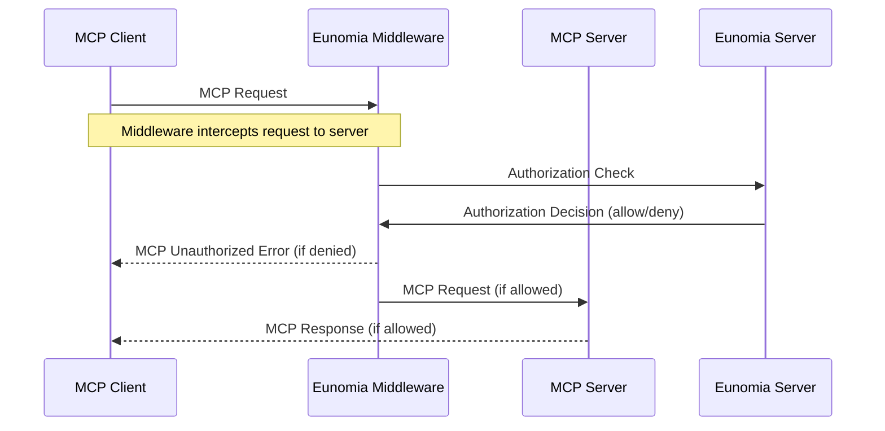

# Eunomia MCP Authorization Middleware

Add **policy-based authorization** to your [MCP][mcp-docs] servers built on [FastMCP][fastmcp-docs] with minimal code changes.

## Overview

### Features

- 🔒 **Policy-Based Authorization**: Control which agents can access which MCP resources and tools
- 📊 **Audit Logging**: Track all authorization decisions and violations
- ⚡ **FastMCP Integration**: One-line middleware integration with FastMCP servers
- 🔧 **Flexible Configuration**: JSON-based policies with support for complex rules
- 🎯 **MCP-Aware**: Built-in understanding of MCP protocol (tools, resources, prompts)

### Architecture



### Installation

```bash
pip install eunomia-mcp
```

## Quick Start

### Create a MCP Server with Middleware

#### Basic Integration

```python
from fastmcp import FastMCP
from eunomia_mcp import EunomiaMcpMiddleware

# Create your FastMCP server
mcp = FastMCP("Secure MCP Server 🔒")

@mcp.tool()
def add(a: int, b: int) -> int:
    """Add two numbers"""
    return a + b

# Add Eunomia authorization middleware
middleware = EunomiaMcpMiddleware()

# Create ASGI app with authorization
app = mcp.add_middleware(middleware)

if __name__ == "__main__":
    mcp.run()
```

> [!IMPORTANT]
>
> [Eunomia][eunomia-github] is a standalone server that handles the policy decisions, you must have it running alongside the MCP server.
>
> Run it in the background with Docker:
>
> ```bash
> docker run -d -p 8000:8000 --name eunomia ttommitt/eunomia-server:latest
> ```
>
> Or refer to the [Eunomia documentation][eunomia-docs-run-server] for more options.

#### Advanced Integration

Configure the middleware with custom options for production deployments:

```python
from fastmcp import FastMCP
from eunomia_mcp import create_eunomia_middleware

mcp = FastMCP("Secure MCP Server 🔒")

# Configure middleware with custom options
middleware = [
    create_eunomia_middleware(
        eunomia_endpoint="https://your-eunomia-server.com",
        eunomia_api_key="your-api-key",
        enable_audit_logging=True,
    )
]

app = mcp.http_app(middleware=middleware)
```

### Policy Configuration

Use the `eunomia-mcp` CLI to manage your MCP authorization policies:

#### Initialize a New Project

```bash
# Create a default policy configuration file
eunomia-mcp init

# Create policy configuration file with custom name
eunomia-mcp init --policy-file my_policies.json

# Generate both policy configuration file and a sample MCP server
eunomia-mcp init --sample
```

You can now edit the policy configuration file to your liking.

#### Validate Policy Configuration

```bash
# Validate your policy file
eunomia-mcp validate mcp_policies.json
```

#### Push Policies to Eunomia

```bash
# Push your policy to Eunomia server
eunomia-mcp push mcp_policies.json

# Push your policy and overwrite existing ones
eunomia-mcp push mcp_policies.json --overwrite
```

> [!IMPORTANT]
> You need the Eunomia server running for the push operation.

**Workflow**: Initialize → Customize policies → Validate → Run Eunomia server → Push to Eunomia → Run MCP server

## Further Reading

### MCP Method Mappings

| MCP Method       | Resource URI           | Action | Middleware behavior                       |
| ---------------- | ---------------------- | ------ | ----------------------------------------- |
| `tools/list`     | `mcp:tools:{name}`     | `list` | Filters the server's response             |
| `resources/list` | `mcp:resources:{name}` | `list` | Filters the server's response             |
| `prompts/list`   | `mcp:prompts:{name}`   | `list` | Filters the server's response             |
| `tools/call`     | `mcp:tools:{name}`     | `call` | Blocks/forwards the request to the server |
| `resources/read` | `mcp:resources:{name}` | `read` | Blocks/forwards the request to the server |
| `prompts/get`    | `mcp:prompts:{name}`   | `get`  | Blocks/forwards the request to the server |

The Middleware extracts additional attributes from the request that are passed to the decision engine that can be referenced in policies. The attributes are in the form of:

| Attribute        | Type              | Description                                                          |
| ---------------- | ----------------- | -------------------------------------------------------------------- |
| `method`         | `str`             | The MCP method being called                                          |
| `component_type` | `str`             | The type of component being called (`tools`, `prompts`, `resources`) |
| `name`           | `str`             | The name of the component being called (e.g. `file_read`)            |
| `uri`            | `str`             | The URI of the component being called (e.g. `mcp:tools:file_read`)   |
| `arguments`      | `dict` (optional) | The arguments passed to the component being called                   |

### Authentication

#### Agent Identification

Agents are identified through HTTP headers:

```http
X-Agent-ID: claude
X-User-ID: user123
User-Agent: Claude
Authorization: Bearer api-key-here
```

#### Custom Principal Extraction

You can customize principal extraction by subclassing the middleware:

```python
from eunomia_core import schemas
from eunomia_mcp import EunomiaMcpMiddleware

class CustomAuthMiddleware(EunomiaMcpMiddleware):
    def _extract_principal(self) -> schemas.PrincipalCheck:
        # Custom logic to extract principal from JWT, etc.
        return schemas.PrincipalCheck(
            uri="user:john.doe",
            attributes={"role": "admin", "department": "engineering"}
        )
```

### Logging

Enable comprehensive audit logging:

```python
import logging

# Configure logging
logging.basicConfig(level=logging.INFO)
logger = logging.getLogger("eunomia_mcp")

# Authorization success
# INFO: Authorized request | MCP method: tools/call | MCP uri: mcp:tools:file_read | User-Agent: Claude

# Authorization violation
# WARNING: Authorization violation: Access denied for tools/call | MCP method: tools/call | MCP uri: mcp:tools:file_read | User-Agent: Claude
```

## Examples

### [(Sample) Planetary Weather MCP][example-planetary-weather-mcp]

### [WhatsApp MCP to Authorized Contacts][example-whatsapp-mcp]

[mcp-docs]: https://modelcontextprotocol.io
[fastmcp-docs]: https://gofastmcp.com/
[eunomia-github]: https://github.com/whataboutyou-ai/eunomia
[eunomia-docs-run-server]: https://whataboutyou-ai.github.io/eunomia/get_started/user_guide/run_server
[example-planetary-weather-mcp]: https://github.com/whataboutyou-ai/eunomia/tree/main/examples/mcp_planetary_weather
[example-whatsapp-mcp]: https://github.com/whataboutyou-ai/eunomia/tree/main/examples/mcp_whatsapp
